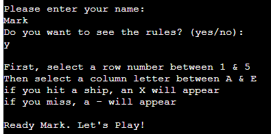
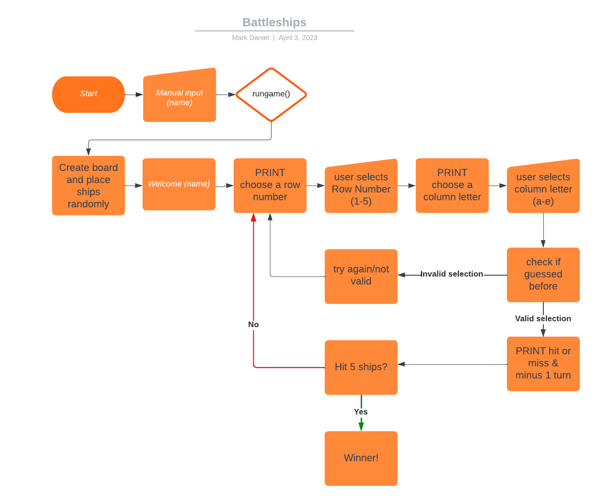

# BATTLESHIPS

Battleships is a Python terminal game, which runs in the Code Institute mock terminal on Heroku.

The aim of the game is to sink all of your opponents battleships. In this version, each ship takes up one square on the board.

[Here is a link to my live version](https://md1982-battleships.herokuapp.com/)

## How to play
______

Battleships is based on the classic pen & paper game. You can read more about it on [Wikipedia](https://en.wikipedia.org/wiki/Battleship_(game)).

In my version, the player first enters their name. they are then asked if they would like to see the rules/instructions. 

A board appears and there are 5 randomly placed ships which are hidden. The user is then prompted to first select a row between 1 -5, and then a column between a - e.

If the selection hits the opponents battleship, an "X" will appear, if it's miss, a "-" (minus symbol) will appear.

The player has 10 attempts to sink all 5 of the opponents ships, each missed shot reduces the number of attempts remaining.

*(Note: for the purposes of testing all text strings, I had set the number of tries to 25, in the final deployed version, this will be limited to 10)*

## Features
_____

* Random ship placement
  * The ships are randomly placed on the board.
  * The position of the ships are hidden from the player. 
* Accepts user input
* Validation & error-checking
  * User cannot enter a selection outside of the scope of the board
  * User cannot enter a null value (by just pressing enter without entering a selection)
  * User cannot use the same guess more than once

Below is a flow of how I had planned the game to run

## Future Implementable Features
_____

* Allow user to select board size
* Allow larger ships
* Allow user to place ships manually
* Allow user to change orientation of larger ships

## Testing
_____
I have manually tested the code using the following methods:
* Passed the code through a PEP8 linter [Code Institute PEP8 Linter](https://pep8ci.herokuapp.com/) and confirmed there are no errors.
* Used code to validate data input by the user when:
  * Entering numbers when letters are expected (and vice-versa).
  * Pressing Enter without chosing row or column.
  * Duplicate guesses.
* Tested the code myself in both the local terminal and the deployed site using varying methods of entering valid and invalid data.

### Bugs
* Fixed bugs
  * While writing this code, I had an issue where it was not running due to a typo in the code. `AttributeError: module 'random' has no attribute 'randit'`. I fixed this by searching for randit, and correcting the typo.
  * I had the following error `TypeError: 'PlayArea' object is not subscriptable`. This was fixed by (rather painstakingly) reading through the code, to look for anything that didn't look right. Luckily I managed to spot the issue and correct it. I had missed `.board` in the function that places the ships.
  * While testing validation and error messages, I discovered that there was no validation for when the user didnt enter a value for the row and/or column (ie, they just pressed enter without entering anything). This would have caused the game to fail, but I have now added code to check for null entries
  * When I felt I had a completed product, I passed the code through the PEP8 linter (linked above). The first time I was given the following errors:
.
   
   These were all corrected immediately with the exception of the error in lines 34 and 104 (steps to fix stated below).
  * The issue with the error in Line 34 was fixed by renaming the variable "user_board" to "usrbd" to reduce the number of characters in the code to fit with the restrictions in Code Institue's mock terminal for Heroku (the length is limited to 79 characters wide). Line 104 was fixed by simply removing 1 word ("Please")

* Unresolved Bugs
 * To my knowledge, There are no unresolved bugs

## Deployment
This project was deployed using Code Institue's mock terminal for Heroku.

 * Steps for deployment
  * Create in gitpod
  * commit/push to github
  * Create a new app in Heroku
  * link Heroku to Github repository
  * Click on **Deploy**

## Credits
_____
* Code institute
  * Mock Terminal in Heroku
  * Structure and layout for Readme

* Markdown Cheatsheet - https://www.markdownguide.org/cheat-sheet/

* Code for Rules section (Basic idea used, but code was modified to suit this application) https://bobbyhadz.com/blog/python-input-yes-no

* I watched and attempted several walkthrough projects on youtube before starting to create my own game including:
  * https://www.youtube.com/watch?v=tF1WRCrd_HQ
  * https://www.youtube.com/watch?v=7Ki_2gr0rsE
  * https://www.youtube.com/watch?v=MgJBgnsDcF0

The first video linked above is where I took most of my inspiration from as this had the most similar structure to what I had imagined before I started on my own version of the game.